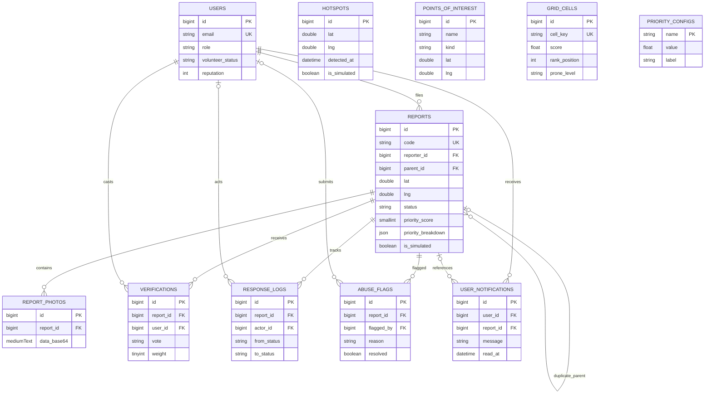

# ERD APIKAWAL

```mermaid
erDiagram
    USERS ||--o{ REPORTS : files
    REPORTS o|--o{ REPORTS : duplicate_parent
    REPORTS ||--o{ REPORT_PHOTOS : contains
    REPORTS ||--o{ VERIFICATIONS : receives
    USERS ||--o{ VERIFICATIONS : casts
    REPORTS ||--o{ RESPONSE_LOGS : tracks
    USERS o|--o{ RESPONSE_LOGS : acts
    REPORTS ||--o{ ABUSE_FLAGS : flagged
    USERS o|--o{ ABUSE_FLAGS : submits
    USERS ||--o{ USER_NOTIFICATIONS : receives
    REPORTS o|--o{ USER_NOTIFICATIONS : references
    REPORTS {
      bigint id PK
      string code UK
      bigint reporter_id FK
      bigint parent_id FK
      double lat
      double lng
      string status
      smallint priority_score
      json priority_breakdown
      boolean is_simulated
    }
    USERS {
      bigint id PK
      string email UK
      string role
      string volunteer_status
      int reputation
    }
    REPORT_PHOTOS { bigint id PK bigint report_id FK mediumText data_base64 }
    VERIFICATIONS { bigint id PK bigint report_id FK bigint user_id FK string vote tinyint weight }
    RESPONSE_LOGS { bigint id PK bigint report_id FK bigint actor_id FK string from_status string to_status }
    ABUSE_FLAGS { bigint id PK bigint report_id FK bigint flagged_by FK string reason boolean resolved }
    HOTSPOTS { bigint id PK double lat double lng datetime detected_at boolean is_simulated }
    POINTS_OF_INTEREST { bigint id PK string name string kind double lat double lng }
    GRID_CELLS { bigint id PK string cell_key UK float score int rank_position string prone_level }
    PRIORITY_CONFIGS { string name PK float value string label }
    USER_NOTIFICATIONS { bigint id PK bigint user_id FK bigint report_id FK string message datetime read_at }
```

Index utama: report status/prioritas/waktu, koordinat, parent; unique `(report_id,user_id)` verifikasi; hotspot waktu; user notification user/read/time.
