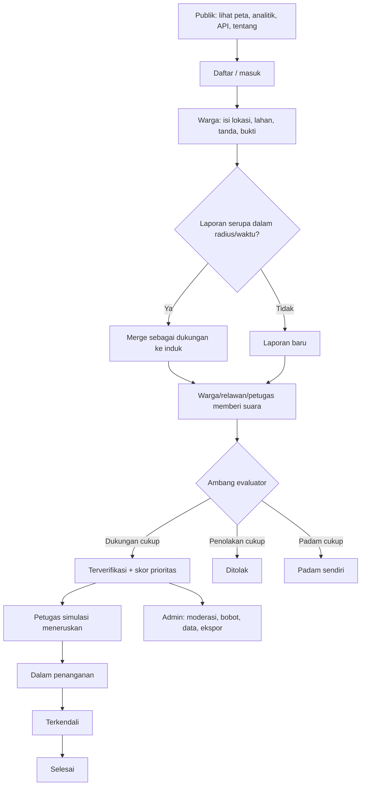

# User flow

```mermaid
flowchart TD
    P[Publik: lihat peta, analitik, API, tentang] --> R[Daftar / masuk]
    R --> W[Warga: isi lokasi, lahan, tanda, bukti]
    W --> D{Laporan serupa dalam radius/waktu?}
    D -->|Ya| M[Merge sebagai dukungan ke induk]
    D -->|Tidak| N[Laporan baru]
    M --> V[Warga/relawan/petugas memberi suara]
    N --> V
    V --> E{Ambang evaluator}
    E -->|Dukungan cukup| T[Terverifikasi + skor prioritas]
    E -->|Penolakan cukup| X[Ditolak]
    E -->|Padam cukup| Z[Padam sendiri]
    T --> O[Petugas simulasi meneruskan]
    O --> H[Dalam penanganan]
    H --> K[Terkendali]
    K --> S[Selesai]
    T --> A[Admin: moderasi, bobot, data, ekspor]
```

Peran: warga melapor/verifikasi dan mengelola profil; relawan memerlukan persetujuan admin; petugas mengelola antrean; admin mengelola akun, moderasi dan data.
